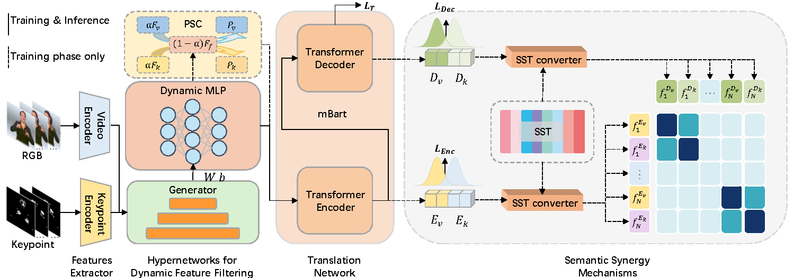

## HyperSign

This repository contains the code for HyperSign: Dynamic Feature Fusion for Sign Language Translation Using HyperNetworks.

HyperSign is built upon the robust foundation laid by [MMTLB](https://arxiv.org/abs/2203.04287). We extend our sincere thanks to the authors for their excellent work!

## Introduction
Sign language is a visual language that conveys information through gestures and facial expressions. For the task of sign language translation, the fusion of RGB and keypoint information has been proven effective, but existing methods often use late fusion approaches, causing the dual streams to be decoded repeatedly, which makes it difficult to extract useful features based on the characteristics of different streams.This paper designs an early fusion method that uses hypernetworks to dynamically fuse dual-stream features, and employs a partial shortcut connection strategy to guide the gradual fusion of the dual streams. To bring the dual-stream features as close as possible for easier feature selection and fusion, we also explored various techniques, including self-distillation and SST contrastive learning. Experimental results show that the method proposed in this paper achieves state-of-the-art performance on two public datasets.
 

## Performance

| Dataset    | R (Dev) | B1    | B2    | B3    | B4    | R (Test) | B1    | B2    | B3    | B4    |
| ---------- | ------- | ----- | ----- | ----- | ----- | -------- | ----- | ----- | ----- | ----- |
| PHOENIX14T | 54.98   | 55.35 | 43.06 | 35.21 | 29.78 | 54.51    | 55.20 | 42.80 | 34.84 | 29.42 |
| CSL-Daily  | 57.32   | 58.68 | 45.54 | 36.08 | 29.28 | 57.89    | 58.96 | 45.93 | 36.53 | 29.55 |

## Implementation

- Code for the *Hyper-Network* can be found in the file `./modeling/FusionNet/HyperNet.py`.

- The *SST comparative learning* module is implemented in `./modeling/SST/SST_network.py`.

- Additional implementations are located within `./modeling/translation.py`.


### Prerequisites 

```sh
conda env create -f environment.yml
conda activate slt
```

### Data preparation

The raw data are from:

- [PHOENIX14T](https://www-i6.informatik.rwth-aachen.de/~koller/RWTH-PHOENIX-2014-T/)
- [CSL-Daily](http://home.ustc.edu.cn/~zhouh156/dataset/csl-daily/)

Please refer to the [implementation of TS-Network](https://github.com/FangyunWei/SLRT/blob/main/TwoStreamNetwork/docs/TwoStream-SLR.md)  for preparing the data and models, as HyperSign focuses on the SLT training. Specifically, the required processed data and pre-trained models include:

- Pre-extracted RGB and keypoint features.  Pre-train the visual encoder (`csl-daily_video.yaml`, `csl-daily_keypoint.yaml`) and the keypoint encoder (`phoenix-2014t_video.yaml`, `phoenix-2014_keypoint.yaml`). Use these encoders to extract the corresponding visual and keypoint features.

```shell
for dataset in phoenix-2014t csl-daily; do
    for stream in video keypoint; do
        python -m torch.distributed.launch --nproc_per_node 1 --use_env training.py \
        --config experiments/configs/TwoStream/${dataset}_${stream}.yaml
        python -m torch.distributed.launch --nproc_per_node 1 --use_env extract_feature.py \
        --config experiments/configs/TwoStream/${dataset}_${stream}.yaml
    done
done
```

- Pre-trained mBart modules (trained on g2t task) following [MMTLB](https://hkustconnect-my.sharepoint.com/:f:/g/personal/rzuo_connect_ust_hk/EuJlnAhX7h9NnvFZhQH-_fcBtV8lbnj2CphiuidhhcU69w?e=eOsQ4B). Please download the corresponding directories and place them under `./pretrained_models` 

> Note that the path is configured in the \*.yaml file and you can change it anywhere you want.

### Train and Evaluate

**Train**

```shell
dataset=phoenix-2014t #phoenix14t / csl-daily
python -m torch.distributed.launch \
--nproc_per_node 1 \
--use_env training.py \
--config experiments/configs/SingleStream/${dataset}_s2t_fusion.yaml
```

**Evaluate**

Upon finishing training, your can evaluate the model with:

```shell
dataset=phoenix-2014t #phoenix14t / csl-daily
python -m torch.distributed.launch \
--nproc_per_node 1 \
--use_env prediction.py  \
--config experiments/configs/SingleStream/${dataset}_s2t_fusion.yaml
```
